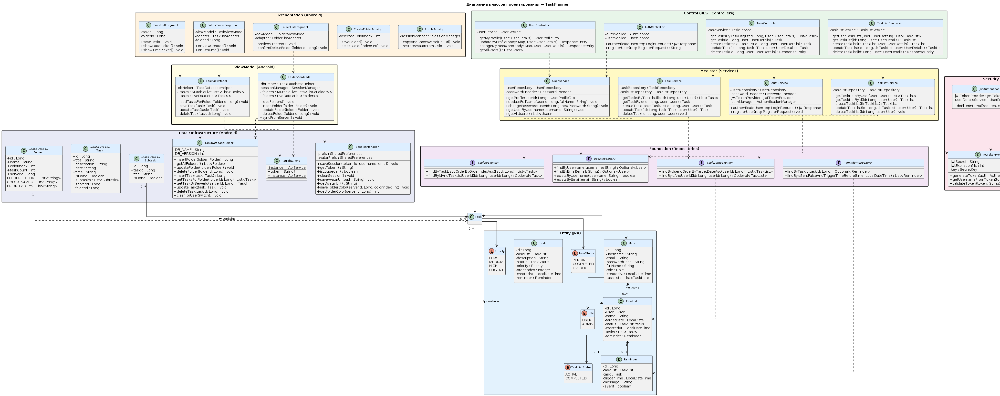

# Диаграмма классов проектирования

## Диаграмма



> Для регенерации изображения используй PlantUML-код ниже:
> вставь на [plantuml.com](https://www.plantuml.com/plantuml/uml/) и сохрани как `class-diagram.jpg`

```plantuml
@startuml class-diagram
title Диаграмма классов проектирования — TaskPlanner

skinparam classAttributeIconSize 0
skinparam classFontSize 11
skinparam classHeaderBackgroundColor #DDEEFF
skinparam packageStyle rectangle
skinparam linetype ortho

' ═══════════════════════════════════════════════════════════
' СЕРВЕРНАЯ ЧАСТЬ (Spring Boot)
' ═══════════════════════════════════════════════════════════

package "Control (REST Controllers)" #E8F5E9 {

  class AuthController {
    - authService : AuthService
    - userService : UserService
    + authenticateUser(req: LoginRequest) : JwtResponse
    + registerUser(req: RegisterRequest) : String
  }

  class TaskListController {
    - taskListService : TaskListService
    + getUserTaskLists(user: UserDetails) : List<TaskList>
    + getTaskList(id: Long, user: UserDetails) : TaskList
    + createTaskList(tl: TaskList, user: UserDetails) : TaskList
    + updateTaskList(id: Long, tl: TaskList, user: UserDetails) : TaskList
    + deleteTaskList(id: Long, user: UserDetails) : ResponseEntity
  }

  class TaskController {
    - taskService : TaskService
    + getTasksByTaskList(listId: Long, user: UserDetails) : List<Task>
    + getTask(id: Long, user: UserDetails) : Task
    + createTask(task: Task, listId: Long, user: UserDetails) : Task
    + updateTask(id: Long, task: Task, user: UserDetails) : Task
    + deleteTask(id: Long, user: UserDetails) : ResponseEntity
  }

  class UserController {
    - userService : UserService
    + getMyProfile(user: UserDetails) : UserProfileDto
    + updateMyProfile(body: Map, user: UserDetails) : ResponseEntity
    + changeMyPassword(body: Map, user: UserDetails) : ResponseEntity
    + getAllUsers() : List<User>
  }
}

package "Mediator (Services)" #FFF9C4 {

  class AuthService {
    - userRepository : UserRepository
    - passwordEncoder : PasswordEncoder
    - jwtTokenProvider : JwtTokenProvider
    - authManager : AuthenticationManager
    + authenticateUser(req: LoginRequest) : JwtResponse
    + registerUser(req: RegisterRequest) : void
  }

  class TaskListService {
    - taskListRepository : TaskListRepository
    + getTaskListsByUser(user: User) : List<TaskList>
    + getTaskListById(id: Long, user: User) : TaskList
    + createTaskList(tl: TaskList) : TaskList
    + updateTaskList(id: Long, tl: TaskList, user: User) : TaskList
    + deleteTaskList(id: Long, user: User) : void
  }

  class TaskService {
    - taskRepository : TaskRepository
    - taskListRepository : TaskListRepository
    + getTasksByTaskList(listId: Long, user: User) : List<Task>
    + getTaskById(id: Long, user: User) : Task
    + createTask(task: Task, listId: Long, user: User) : Task
    + updateTask(id: Long, task: Task, user: User) : Task
    + deleteTask(id: Long, user: User) : void
  }

  class UserService {
    - userRepository : UserRepository
    - passwordEncoder : PasswordEncoder
    + getProfile(userId: Long) : UserProfileDto
    + updateFullName(userId: Long, fullName: String) : void
    + changePassword(userId: Long, newPassword: String) : void
    + getUserByUsername(username: String) : User
    + getAllUsers() : List<User>
  }
}

package "Security" #FCE4EC {

  class JwtTokenProvider {
    - jwtSecret : String
    - jwtExpirationMs : int
    - key : SecretKey
    + generateToken(auth: Authentication) : String
    + getUsernameFromToken(token: String) : String
    + validateToken(token: String) : boolean
  }

  class JwtAuthenticationFilter {
    - jwtTokenProvider : JwtTokenProvider
    - userDetailsService : UserDetailsServiceImpl
    + doFilterInternal(req, res, chain) : void
  }
}

package "Entity (JPA)" #E3F2FD {

  class User {
    - id : Long
    - username : String
    - email : String
    - passwordHash : String
    - fullName : String
    - role : Role
    - createdAt : LocalDateTime
    - taskLists : List<TaskList>
  }

  class TaskList {
    - id : Long
    - user : User
    - name : String
    - targetDate : LocalDate
    - status : TaskListStatus
    - createdAt : LocalDateTime
    - tasks : List<Task>
    - reminder : Reminder
  }

  class Task {
    - id : Long
    - taskList : TaskList
    - description : String
    - status : TaskStatus
    - priority : Priority
    - orderIndex : Integer
    - createdAt : LocalDateTime
    - reminder : Reminder
  }

  class Reminder {
    - id : Long
    - taskList : TaskList
    - task : Task
    - triggerTime : LocalDateTime
    - message : String
    - isSent : boolean
  }

  enum Role {
    USER
    ADMIN
  }

  enum TaskStatus {
    PENDING
    COMPLETED
    OVERDUE
  }

  enum TaskListStatus {
    ACTIVE
    COMPLETED
  }

  enum Priority {
    LOW
    MEDIUM
    HIGH
    URGENT
  }
}

package "Foundation (Repositories)" #F3E5F5 {

  interface UserRepository {
    + findByUsername(username: String) : Optional<User>
    + findByEmail(email: String) : Optional<User>
    + existsByUsername(username: String) : boolean
    + existsByEmail(email: String) : boolean
  }

  interface TaskListRepository {
    + findByUserIdOrderByTargetDateAsc(userId: Long) : List<TaskList>
    + findByIdAndUserId(id: Long, userId: Long) : Optional<TaskList>
  }

  interface TaskRepository {
    + findByTaskListIdOrderByOrderIndexAsc(listId: Long) : List<Task>
    + findByIdAndTaskListUserId(id: Long, userId: Long) : Optional<Task>
  }

  interface ReminderRepository {
    + findByTaskId(taskId: Long) : Optional<Reminder>
    + findByIsSentFalseAndTriggerTimeBefore(time: LocalDateTime) : List<Reminder>
  }
}

' ═══════════════════════════════════════════════════════════
' КЛИЕНТСКАЯ ЧАСТЬ (Android / Kotlin)
' ═══════════════════════════════════════════════════════════

package "Presentation (Android)" #FFF3E0 {

  class FolderListFragment {
    - viewModel : FolderViewModel
    - adapter : FolderListAdapter
    + onViewCreated() : void
    + confirmDeleteFolder(folderId: Long) : void
  }

  class FolderTasksFragment {
    - viewModel : TaskViewModel
    - adapter : TaskListAdapter
    - folderId : Long
    + onViewCreated() : void
    + onResume() : void
  }

  class TaskEditFragment {
    - taskId : Long
    - folderId : Long
    + saveTask() : void
    + showDatePicker() : void
    + showTimePicker() : void
  }

  class CreateFolderActivity {
    - selectedColorIndex : Int
    + saveFolder() : void
    + selectColor(index: Int) : void
  }

  class ProfileActivity {
    - sessionManager : SessionManager
    + copyAndShowAvatar(uri: Uri) : void
    + restoreAvatarFromDisk() : void
  }
}

package "ViewModel (Android)" #FFFDE7 {

  class FolderViewModel {
    - dbHelper : TaskDatabaseHelper
    - sessionManager : SessionManager
    - _folders : MutableLiveData<List<Folder>>
    + folders : LiveData<List<Folder>>
    + loadFolders() : void
    + insertFolder(folder: Folder) : void
    + updateFolder(folder: Folder) : void
    + deleteFolder(folderId: Long) : void
    + syncFromServer() : void
  }

  class TaskViewModel {
    - dbHelper : TaskDatabaseHelper
    - _tasks : MutableLiveData<List<Task>>
    + tasks : LiveData<List<Task>>
    + loadTasksForFolder(folderId: Long) : void
    + saveTask(task: Task) : void
    + updateTask(task: Task) : void
    + deleteTask(taskId: Long) : void
  }
}

package "Data / Infrastructure (Android)" #E8EAF6 {

  class Folder <<data class>> {
    + id : Long
    + name : String
    + colorIndex : Int
    + taskCount : Int
    + serverId : Long
    {static} FOLDER_COLORS : List<String>
    {static} COLOR_NAMES : List<String>
    {static} PRIORITY_KEYS : List<String>
  }

  class Task <<data class>> {
    + id : Long
    + title : String
    + description : String
    + date : String
    + time : String
    + isDone : Boolean
    + subtasks : List<Subtask>
    + serverId : Long
    + folderId : Long
  }

  class Subtask <<data class>> {
    + id : Long
    + taskId : Long
    + title : String
    + isDone : Boolean
  }

  class TaskDatabaseHelper {
    - DB_NAME : String
    - DB_VERSION : Int
    + insertFolder(folder: Folder) : Long
    + getAllFolders() : List<Folder>
    + updateFolder(folder: Folder) : void
    + deleteFolder(folderId: Long) : void
    + insertTask(task: Task) : Long
    + getTasksForFolder(folderId: Long) : List<Task>
    + getTaskByServerId(serverId: Long) : Task?
    + updateTask(task: Task) : void
    + deleteTask(taskId: Long) : void
    + clearForUserSwitch() : void
  }

  class RetrofitClient {
    {static} - instance_ : ApiService
    {static} + token : String?
    {static} + instance : ApiService
  }

  class SessionManager {
    - prefs : SharedPreferences
    - avatarPrefs : SharedPreferences
    + saveSession(token, id, username, email) : void
    + getToken() : String?
    + isLoggedIn() : boolean
    + clearSession() : void
    + saveAvatarUri(path: String) : void
    + getAvatarUri() : String?
    + saveFolderColor(serverId: Long, colorIndex: Int) : void
    + getFolderColor(serverId: Long) : Int
  }
}

' ═══════════════════════════════════════════════════════════
' СВЯЗИ
' ═══════════════════════════════════════════════════════════

' Server: Controller → Service
AuthController ..> AuthService
AuthController ..> UserService
TaskListController ..> TaskListService
TaskController ..> TaskService
UserController ..> UserService

' Server: Service → Repository
AuthService ..> UserRepository
TaskListService ..> TaskListRepository
TaskService ..> TaskRepository
TaskService ..> TaskListRepository
UserService ..> UserRepository

' Server: Repository → Entity
UserRepository ..> User
TaskListRepository ..> TaskList
TaskRepository ..> Task
ReminderRepository ..> Reminder

' Server: Entity associations
User "1" *-- "0..*" TaskList : owns >
TaskList "1" *-- "0..*" Task : contains >
Task "1" *-- "0..1" Reminder
TaskList "1" *-- "0..1" Reminder

' Server: Enum usage
User --> Role
Task --> TaskStatus
Task --> Priority
TaskList --> TaskListStatus

' Server: Security
JwtAuthenticationFilter ..> JwtTokenProvider
AuthService ..> JwtTokenProvider

' Client: Fragment → ViewModel
FolderListFragment ..> FolderViewModel
FolderTasksFragment ..> TaskViewModel
TaskEditFragment ..> TaskViewModel

' Client: ViewModel → Infrastructure
FolderViewModel ..> TaskDatabaseHelper
FolderViewModel ..> RetrofitClient
FolderViewModel ..> SessionManager
TaskViewModel ..> TaskDatabaseHelper
TaskViewModel ..> RetrofitClient

' Client: Data associations
Task "1" *-- "0..*" Subtask
Folder "1" ..> "0..*" Task : contains >

@enduml
```



---

## Клиентская часть (Android)

### Слой Presentation

```
+---------------------------+       +---------------------------+
|     FolderListFragment    |       |    FolderTasksFragment    |
+---------------------------+       +---------------------------+
| - viewModel: FolderVM     |       | - viewModel: TaskVM       |
| - adapter: FolderListAdap.|       | - adapter: TaskListAdap.  |
| - folderId: Long          |       | - folderId: Long          |
+---------------------------+       | - folderName: String      |
| + onViewCreated()         |       +---------------------------+
| + confirmDeleteFolder()   |       | + onViewCreated()         |
+---------------------------+       | + onResume()              |
                                    +---------------------------+

+---------------------------+       +---------------------------+
|     TaskEditFragment      |       |    CreateFolderActivity   |
+---------------------------+       +---------------------------+
| - taskId: Long            |       | - selectedColorIndex: Int |
| - folderId: Long          |       | - chipIds: List<Int>      |
+---------------------------+       +---------------------------+
| + saveTask()              |       | + saveFolder()            |
| + showDatePicker()        |       | + selectColor()           |
| + showTimePicker()        |       +---------------------------+
+---------------------------+
```

### Слой ViewModel

```
+---------------------------+       +---------------------------+
|       FolderViewModel     |       |       TaskViewModel        |
+---------------------------+       +---------------------------+
| - dbHelper: DBHelper      |       | - dbHelper: DBHelper      |
| - _folders: MutableLD     |       | - _tasks: MutableLD       |
+---------------------------+       +---------------------------+
| + loadFolders()           |       | + loadTasksForFolder()    |
| + insertFolder()          |       | + saveTask()              |
| + deleteFolder()          |       | + updateTask()            |
+---------------------------+       | + deleteTask()            |
                                    +---------------------------+
```

### Слой Data / Infrastructure

```
+---------------------------+       +---------------------------+
|    TaskDatabaseHelper     |       |       RetrofitClient      |
+---------------------------+       +---------------------------+
| - DB_NAME: String         |       | - token: String?          |
| - DB_VERSION: Int         |       | - instance: ApiService    |
+---------------------------+       +---------------------------+
| + insertFolder()          |       | + getInstance()           |
| + getAllFolders()          |       |   : ApiService            |
| + deleteFolder()          |       +---------------------------+
| + insertTask()            |
| + getTasksForFolder()     |       +---------------------------+
| + deleteTask()            |       |       SessionManager      |
+---------------------------+       +---------------------------+
                                    | - prefs: SharedPrefs      |
                                    +---------------------------+
                                    | + saveToken()             |
                                    | + getToken()              |
                                    | + saveFullName()          |
                                    | + getFullName()           |
                                    | + isLoggedIn()            |
                                    | + clearSession()          |
                                    +---------------------------+
```

---

## Серверная часть (Spring Boot)

### Слой Control

```
+---------------------------+       +---------------------------+
|      AuthController       |       |   TaskListController      |
+---------------------------+       +---------------------------+
| - userService: IUserSvc   |       | - service: ITaskListSvc   |
| - jwtService: JwtService  |       +---------------------------+
+---------------------------+       | + getAll()                |
| + login()                 |       | + getById()               |
| + register()              |       | + create()                |
+---------------------------+       | + update()                |
                                    | + delete()                |
+---------------------------+       +---------------------------+
|      TaskController       |
+---------------------------+       +---------------------------+
| - service: ITaskService   |       |      UserController       |
+---------------------------+       +---------------------------+
| + getByList()             |       | - service: IUserService   |
| + create()                |       +---------------------------+
| + update()                |       | + getProfile()            |
| + delete()                |       | + updateProfile()         |
+---------------------------+       +---------------------------+
```

### Слой Mediator (Service)

```
+---------------------------+       +---------------------------+
|       UserService         |       |     TaskListService       |
+---------------------------+       +---------------------------+
| - repo: UserRepository    |       | - repo: TaskListRepo      |
| - jwtService: JwtService  |       | - userRepo: UserRepo      |
| - encoder: PwdEncoder     |       +---------------------------+
+---------------------------+       | + create()                |
| + registerUser()          |       | + getAll()                |
| + authenticate()          |       | + getById()               |
| + getUserById()           |       | + update()                |
+---------------------------+       | + delete()                |
                                    +---------------------------+

+---------------------------+       +---------------------------+
|       TaskService         |       |       JwtService          |
+---------------------------+       +---------------------------+
| - repo: TaskRepository    |       | - secretKey: String       |
| - listRepo: TaskListRepo  |       | - expiration: Long        |
+---------------------------+       +---------------------------+
| + createTask()            |       | + generateToken()         |
| + updateTask()            |       | + validateToken()         |
| + deleteTask()            |       | + extractUserId()         |
| + markCompleted()         |       +---------------------------+
+---------------------------+
```

### Слой Entity

```
+---------------------------+
|           User            |
+---------------------------+
| - id: Long                |
| - username: String        |
| - email: String           |
| - passwordHash: String    |
| - fullName: String        |
| - role: Role (enum)       |
| - createdAt: LocalDateTime|
| - taskLists: List<TaskList>|
+---------------------------+

+---------------------------+       +---------------------------+
|         TaskList          |       |           Task            |
+---------------------------+       +---------------------------+
| - id: Long                |       | - id: Long                |
| - user: User              |       | - taskList: TaskList      |
| - name: String            |       | - description: String     |
| - targetDate: LocalDate   |       | - status: TaskStatus      |
| - status: ListStatus      |       | - priority: Priority      |
| - tasks: List<Task>       |       | - orderIndex: Int         |
| - createdAt: LDT          |       | - createdAt: LDT          |
+---------------------------+       +---------------------------+
```

### Слой Foundation (Repository)

```
+---------------------------+       +---------------------------+
|      UserRepository       |       |   TaskListRepository      |
+---------------------------+       +---------------------------+
| extends JpaRepository     |       | extends JpaRepository     |
+---------------------------+       +---------------------------+
| + findByEmail()           |       | + findByUserIdOrderBy...  |
| + existsByEmail()         |       | + findByIdAndUserId()     |
| + existsByUsername()      |       +---------------------------+
+---------------------------+
                                    +---------------------------+
                                    |     TaskRepository        |
                                    +---------------------------+
                                    | extends JpaRepository     |
                                    +---------------------------+
                                    | + findByTaskListId...     |
                                    | + findByIdAndUserId()     |
                                    | + countByUserId()         |
                                    +---------------------------+
```
