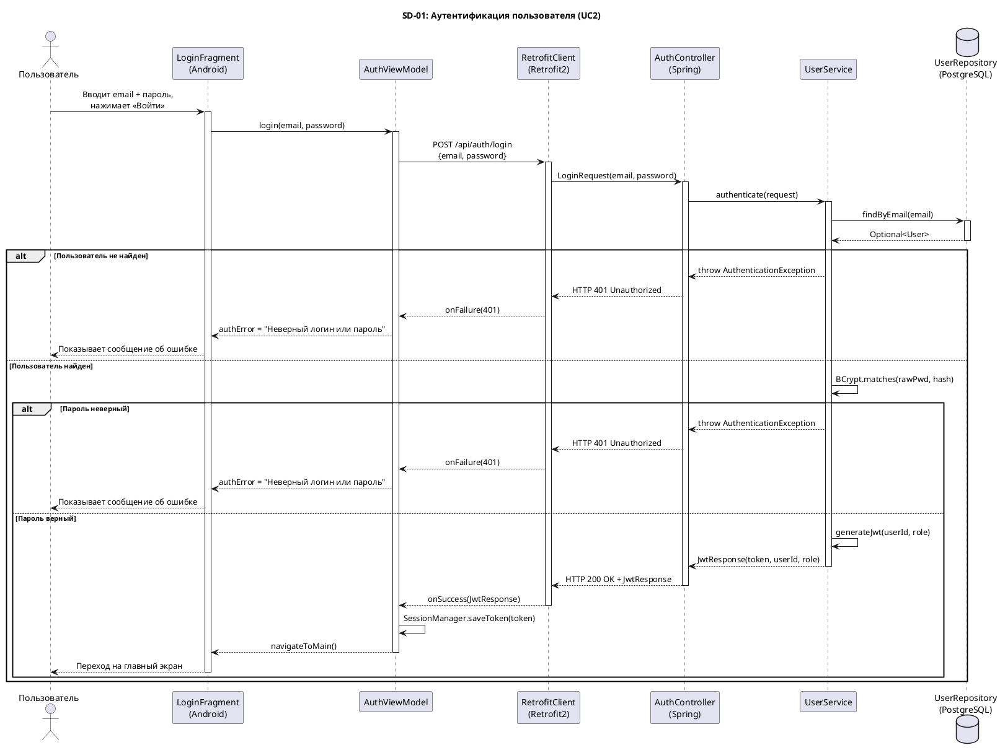
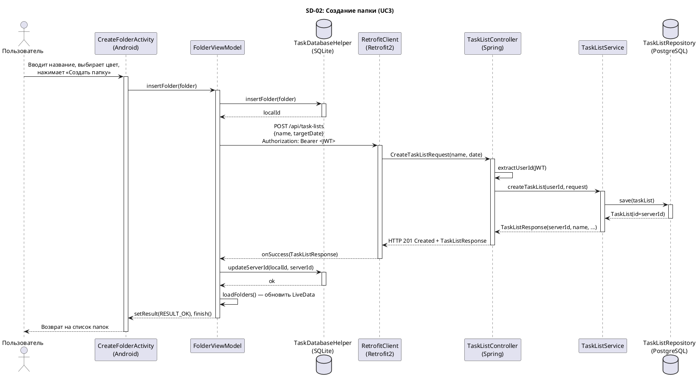
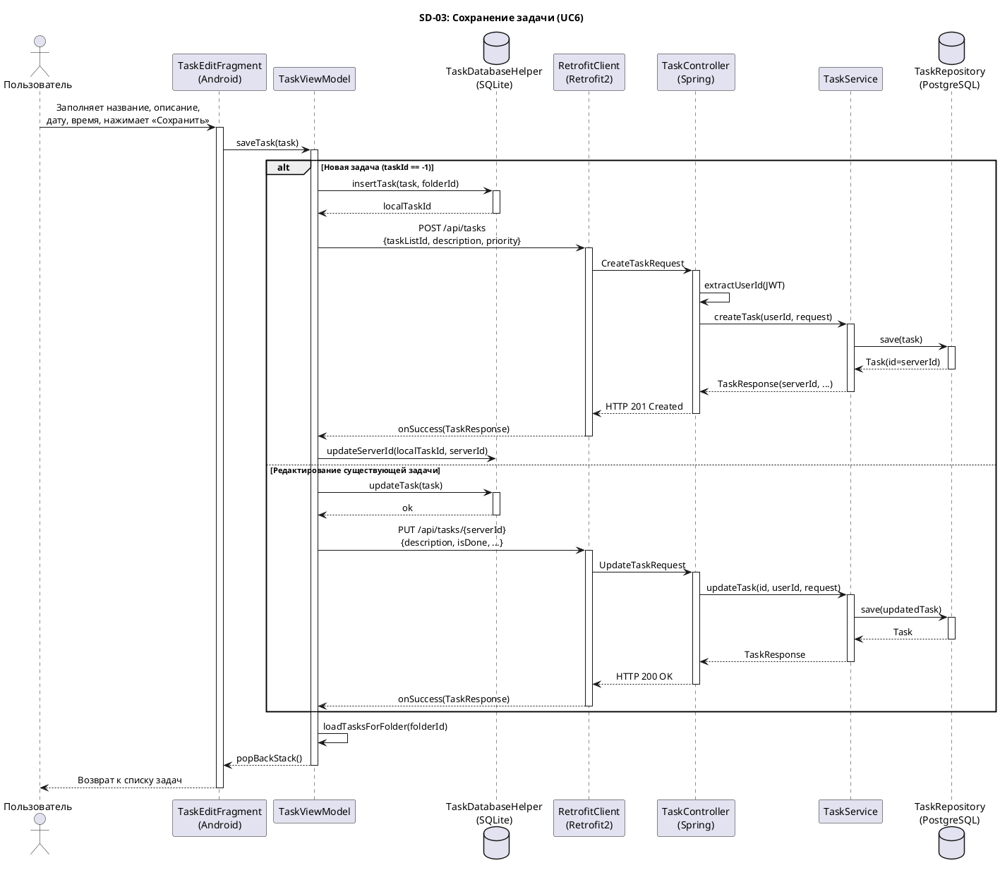
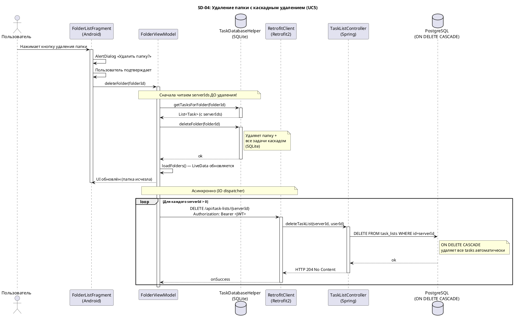

# Диаграммы последовательности

Описывают динамику взаимодействия компонентов системы при выполнении ключевых сценариев.

---

## SD-01: Аутентификация пользователя (UC2)

**Участники:** `LoginFragment` → `AuthViewModel` → `RetrofitClient` → `AuthController` → `UserService` → `UserRepository`

---

## SD-02: Создание папки (UC3)

**Участники:** `CreateFolderActivity` → `FolderViewModel` → `TaskDatabaseHelper` / `RetrofitClient` → `TaskListController` → `TaskListService` → `TaskListRepository`

---

## SD-03: Сохранение задачи (UC6)

**Участники:** `TaskEditFragment` → `TaskViewModel` → `TaskDatabaseHelper` / `RetrofitClient` → `TaskController` → `TaskService` → `TaskRepository`

---

## SD-04: Удаление папки с каскадным удалением (UC5)

**Участники:** `FolderListFragment` → `FolderViewModel` → `TaskDatabaseHelper` / `RetrofitClient` → `TaskListController`

---

## Как сгенерировать диаграммы

1. Скопируй код между `@startuml` и `@enduml`
2. Вставь на сайт **[plantuml.com/plantuml](https://www.plantuml.com/plantuml/uml/)** или используй плагин PlantUML в IntelliJ / VS Code
3. Сохрани результат как `.jpg` в папку `05-detailed-design/images/`

| Файл | Имя для сохранения |
|---|---|
| SD-01 | `seq-login.jpg` |
| SD-02 | `seq-create-folder.jpg` |
| SD-03 | `seq-save-task.jpg` |
| SD-04 | `seq-delete-folder.jpg` |
