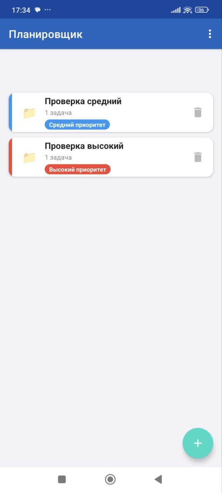
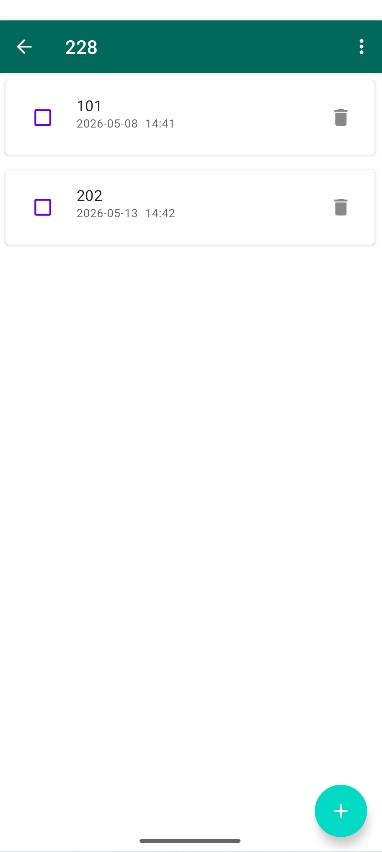
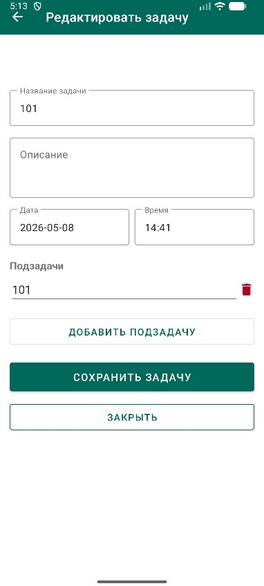
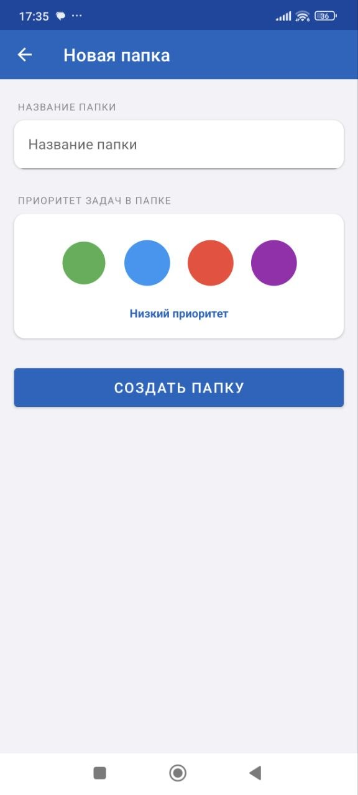
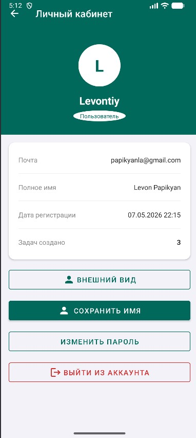

# Этап 7: Интерфейс (Недели 15–16)

## Цель этапа

Реализация и документирование пользовательского интерфейса мобильного приложения и серверного REST API. Обеспечение полного соответствия требованиям траектории В.

## Результаты

| Артефакт | Описание | Документ |
|---|---|---|
| Мобильный интерфейс | 8 экранов, Material Design 3 | [mobile-screens.md](mobile-screens.md) |
| REST API | 15 эндпоинтов, OpenAPI | [api-endpoints.md](api-endpoints.md) |
| Безопасность | JWT, BCrypt, роли | [security.md](security.md) |
| Развёртывание | Запуск сервера и клиента | [deployment.md](deployment.md) |

---

## Скриншоты приложения

### Список папок (главный экран)

### Список задач в папке

### Редактор задачи

### Создание папки

### Профиль пользователя

