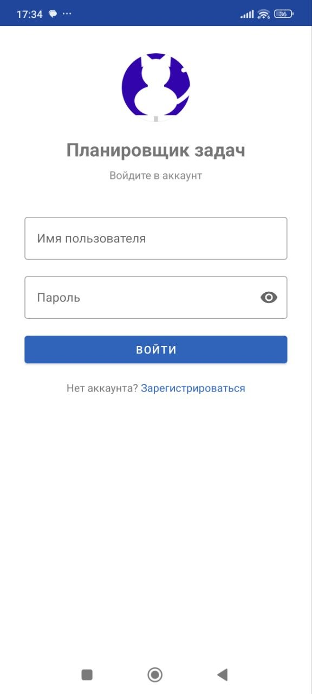
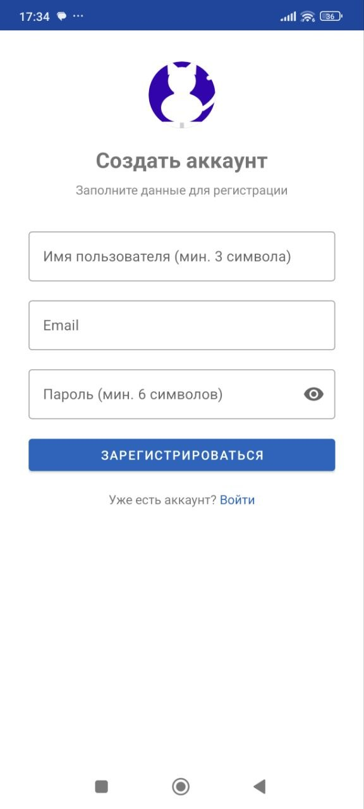

# Мобильный интерфейс (Android)

## Требования траектории В: 5+ экранов ✅ (реализовано 8)

---

## Экраны приложения

### Экран 1: Вход в систему (LoginActivity)

**Функции:**
- Ввод логина и пароля
- Кнопка «Войти»
- Переход на регистрацию
- Валидация полей
- Показ сообщения об ошибке при неверных данных

**Компоненты UI:**
- `TextInputLayout` + `TextInputEditText` для логина и пароля
- `MaterialButton` — Войти
- `TextView` — ссылка на регистрацию



---

### Экран 2: Регистрация (RegisterActivity)

**Функции:**
- Ввод логина, email, пароля
- Валидация: логин ≥ 3 символа, email корректный, пароль ≥ 6 символов
- Переход на главный экран после успешной регистрации



---

### Экран 3: Список папок (FolderListFragment)

**Функции:**
- Список папок с цветовой маркировкой и бейджем приоритета
- FAB «+» — создать папку
- Кнопка удаления на каждой карточке
- Подтверждение удаления через AlertDialog
- Пустое состояние (иконка 📂 + «Папок пока нет»)
- Переход в папку по нажатию

**Компоненты UI:**
- `RecyclerView` + `MaterialCardView`
- `FloatingActionButton`
- `ImageButton` (корзина)
- `TextView` с цветным бейджем приоритета (`GradientDrawable`)


---

### Экран 4: Создание папки (CreateFolderActivity)

**Функции:**
- Ввод названия папки
- Выбор приоритета / цвета (4 варианта):
  - 🟢 Зелёный — Низкий приоритет (LOW)
  - 🔵 Синий — Средний приоритет (MEDIUM)
  - 🔴 Красный — Высокий приоритет (HIGH)
  - 🟣 Фиолетовый — Наивысший приоритет (URGENT)
- Кнопки «Сохранить» / «Отмена»
- Визуальная индикация выбранного цвета (белая обводка)

**Компоненты UI:**
- `TextInputLayout` + `TextInputEditText`
- `LinearLayout` с цветными чипами (`View` + `GradientDrawable`)
- Два `MaterialButton`


---

### Экран 5: Список задач в папке (FolderTasksFragment)

**Функции:**
- Заголовок = название папки
- Кнопка «Назад» в ActionBar
- Список задач с чекбоксами (отметить выполненной)
- FAB «+» — добавить задачу
- Кнопка удаления задачи
- Пустое состояние (✅ + «Задач пока нет»)

**Компоненты UI:**
- `RecyclerView` + `MaterialCardView`
- `CheckBox` для статуса
- `FloatingActionButton`


---

### Экран 6: Редактирование задачи (TaskEditFragment)

**Функции:**
- Поля: название, описание, дата, время
- Встроенный тулбар с кнопкой «Назад»
- Список подзадач с возможностью добавить новую
- Кнопка «Сохранить» — сохранить и закрыть
- Кнопка «Закрыть» — закрыть без сохранения
- `DatePickerDialog` и `TimePickerDialog` для выбора даты/времени

**Компоненты UI:**
- `MaterialToolbar`
- `ScrollView` → `LinearLayout`
- Три `TextInputLayout`
- `RecyclerView` для подзадач
- Два `MaterialButton`


---

### Экран 7: Профиль пользователя (ProfileActivity)

**Функции:**
- Аватар пользователя (инициалы по умолчанию или фото из галереи)
- Выбор фото из галереи — сохраняется во внутреннем хранилище устройства
- Отображение: логин, роль, email, дата регистрации, количество задач
- Редактирование полного имени
- Смена пароля (через диалог)
- Переход к настройкам внешнего вида
- Выход из аккаунта

**Компоненты UI:**
- `FrameLayout` с `ShapeableImageView` (круглое фото) и `TextView` (инициалы)
- `ImageView` — бейдж камеры на аватаре
- `MaterialCardView` с полями профиля
- Четыре `MaterialButton` (внешний вид, сохранить имя, сменить пароль, выйти)


---

### Экран 8: Внешний вид (AppearanceActivity)

**Функции:**
- Выбор цветовой темы приложения (5 вариантов):
  - Фиолетовый (по умолчанию)
  - Синий
  - Зелёный
  - Оранжевый
  - Бирюзовый
- Мгновенное применение темы (пересоздание Activity)
- Сохранение выбора между запусками (`SharedPreferences`)

**Компоненты UI:**
- `RecyclerView` с цветными чипами тем
- `MaterialToolbar` с кнопкой «Назад»

---

## Навигация между экранами

```
LoginActivity ──────────────────────────────────────────> RegisterActivity
      │
      ▼ (JWT получен)
MainActivity
      │
      ├── FolderListFragment (по умолчанию)
      │         │
      │         ├── [FAB] ──────────────────────────────> CreateFolderActivity
      │         │                                               │
      │         │                                               └── finish() → FolderListFragment
      │         │
      │         └── [нажатие на папку] ─────────────────> FolderTasksFragment
      │                   │
      │                   ├── [FAB] ─────────────────────> TaskEditFragment (новая задача)
      │                   │
      │                   └── [нажатие на задачу] ───────> TaskEditFragment (редактирование)
      │
      └── [меню] ─────────────────────────────────────────> ProfileActivity
                                                                  │
                                                                  └── [Внешний вид] ──> AppearanceActivity
```

---

## Соответствие требованиям Material Design 3

| Требование | Реализация |
|---|---|
| Цветовая схема | `colorPrimary`, `colorOnPrimary`, `colorSurface` |
| Компоненты | `MaterialButton`, `MaterialCardView`, `MaterialToolbar` |
| FAB | `FloatingActionButton` с иконкой `ic_add_24dp` |
| Поля ввода | `TextInputLayout.OutlinedBox` |
| Диалоги | `AlertDialog.Builder` из Material |
| Навигация | Back stack через `FragmentManager` |
| Круглые изображения | `ShapeableImageView` + `ShapeAppearanceOverlay.Circle` |
