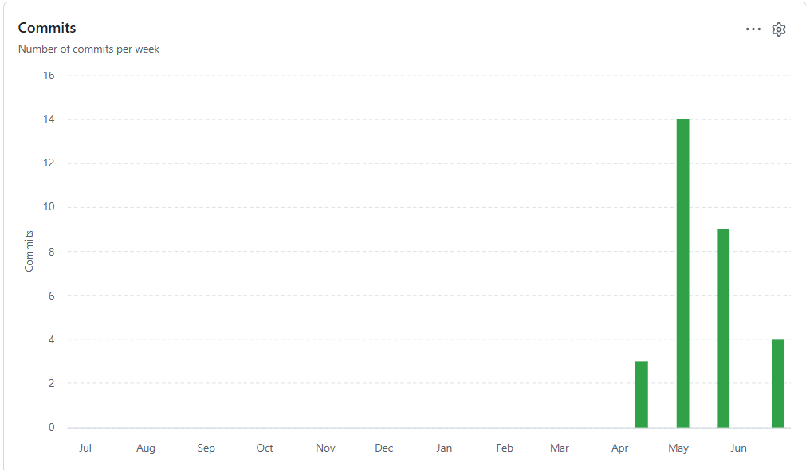
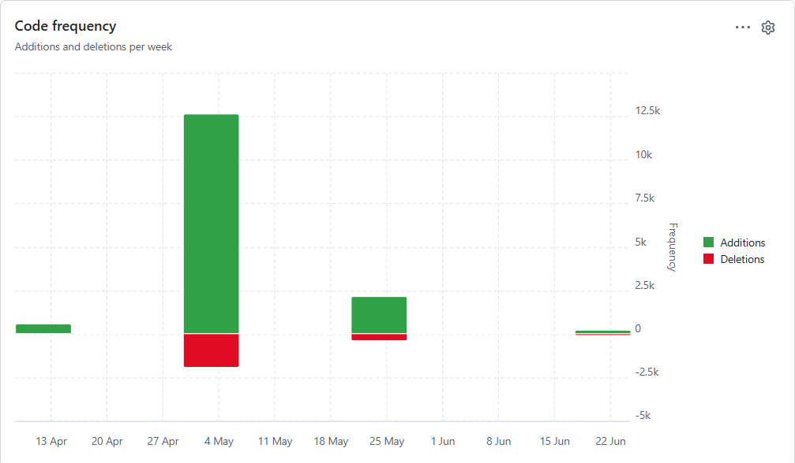

# Курсовой проект: Мобильное приложение «TaskPlanner»

**Траектория В — Мобильная разработка (Android + Spring Boot Backend)**  
**Дисциплина:** Программная Инженерия  
**Институт:** СКФУ  
**Автор:** Папикян Л. А.

---

## Статистика разработки


| Метрика | Значение |
|---|---|
| 📦 Всего коммитов | 30 |
| 📁 Этапов разработки | 9 |
| 🗓 Длительность проекта | 18 недель |
| ⏱ Трудозатраты (WBS) | ~199 ч |
| 📐 Объём кода (COCOMO) | ~3 710 SLOC |
| 🧪 Покрытие тестами | ~55% (JUnit 5 + JaCoCo) |
| 🌐 REST API эндпоинтов | 15 |
| 📱 Экранов в приложении | 8 |
| 🔄 Прецедентов (Use Case) | 11 |
| 📝 Терминов в глоссарии | 33 |
| 🏗 Архитектурных решений (ADR) | 5 |
| 🔧 Рефакторингов (задокументировано) | 6 |

### Языки

| Язык | Доля |
|---|---|
| Kotlin (Android) | 73.8% |
| Java (Spring Boot) | 26.2% |

### График активности коммитов



### Тепловая карта активности (Punch Card)



---

## Описание проекта

**TaskPlanner** — мобильное Android-приложение для личного планирования задач. Позволяет создавать папки (списки дел), добавлять задачи с подзадачами, устанавливать дату и время выполнения. Данные синхронизируются с серверной частью через REST API с JWT-аутентификацией.

### Технологический стек

| Уровень | Технология |
|---|---|
| Мобильное приложение | Android (Kotlin), Material Design 3, Retrofit2, SQLite |
| Серверная часть | Java 17, Spring Boot 3.x, Spring Security, Spring Data JPA |
| База данных (сервер) | PostgreSQL |
| Аутентификация | JWT + BCrypt |
| Документация API | OpenAPI 3 (Swagger UI) |
| Архитектура | PCMEF |

---

## Скриншоты приложения

| Главный экран | Список задач | Редактор задачи |
|---|---|---|
| [](https://github.com/LevontiyVeliki/course-project/blob/main/08-interface/images/screen-folders.jpg) | [](https://github.com/LevontiyVeliki/course-project/blob/main/08-interface/images/screen-tasks.jpg) | [](https://github.com/LevontiyVeliki/course-project/blob/main/08-interface/images/screen-task-edit.jpg) |

| Создание папки | Профиль пользователя |
|---|---|
| [](https://github.com/LevontiyVeliki/course-project/blob/main/08-interface/images/screen-create-folder.jpg) | [](https://github.com/LevontiyVeliki/course-project/blob/main/08-interface/images/screen-profile.jpg) |

---

## Быстрый старт

### Серверная часть (Spring Boot)

```bash
# 1. Создать БД
psql -U postgres -c "CREATE DATABASE taskplanner;"
psql -U postgres -d taskplanner -f 04-database/ddl.sql

# 2. Настроить application.properties (URL, пароль БД, JWT-секрет)

# 3. Собрать и запустить
cd taskplanner-server
mvn clean package -DskipTests
java -jar target/taskplanner-server-1.0.0.jar

# Проверка: http://localhost:8080/swagger-ui/index.html
```

> Требования: JDK 17+, PostgreSQL 14+, Maven 3.8+

### Мобильное приложение (Android)

```bash
# 1. Открыть проект в Android Studio (Hedgehog 2023.1+)
# 2. В RetrofitClient.kt указать BASE_URL:
#    - эмулятор: http://10.0.2.2:8080/
#    - устройство: http://192.168.1.X:8080/
#    - продакшн: https://taskplanner-server-production.up.railway.app/
# 3. Build → Build APK(s)
adb install app/build/outputs/apk/debug/app-debug.apk
```

> Требования: Android API 26+ (Android 8.0)

Подробная инструкция: [deployment.md](https://github.com/LevontiyVeliki/course-project/blob/main/08-interface/deployment.md)

---

## Реализованный функционал

- ✅ Регистрация и вход по логину (JWT-аутентификация)
- ✅ Профиль пользователя (просмотр, редактирование имени, смена пароля)
- ✅ Аватар профиля — выбор из галереи, сохраняется в памяти устройства
- ✅ CRUD папок с выбором приоритета (4 уровня: LOW / MEDIUM / HIGH / URGENT)
- ✅ CRUD задач с подзадачами, датой и временем
- ✅ Приоритет задачи наследуется от папки и синхронизируется с сервером
- ✅ 15 REST API эндпоинтов с документацией OpenAPI
- ✅ Синхронизация с серверной частью (Spring Boot + PostgreSQL на Railway)
- ✅ Полная синхронизация при входе: папки + задачи загружаются с сервера
- ✅ Оффлайн-режим (локальный SQLite-кэш)
- ✅ Удаление папки с каскадным удалением задач на сервере
- ✅ 5 цветовых тем приложения (Material Design)
- ✅ Push-уведомления — напоминания о задачах по дате и времени
- ✅ Модульные тесты (JUnit 5 + Mockito, покрытие ~55%)

---

## Структура документации

### [📁 Этап 0 — Инициация и бизнес-анализ](https://github.com/LevontiyVeliki/course-project/blob/main/01-business-model/README.md) — 5%

| Документ | Описание |
|---|---|
| [Паспорт проекта](https://github.com/LevontiyVeliki/course-project/blob/main/01-business-model/project-passport.md) | Цели, риски, KPI, стек технологий |
| [Бизнес-глоссарий](https://github.com/LevontiyVeliki/course-project/blob/main/01-business-model/glossary.md) | 20 ключевых терминов предметной области |
| [IDEF0 A-0](https://github.com/LevontiyVeliki/course-project/blob/main/01-business-model/images/IDEF0%20A-0.jpg) | Диаграмма бизнес-контекста |
| [BUC-диаграмма](https://github.com/LevontiyVeliki/course-project/blob/main/01-business-model/images/BUC-%D0%B4%D0%B8%D0%B0%D0%B3%D1%80%D0%B0%D0%BC%D0%BC%D0%B0.jpg) | Бизнес-прецеденты |
| [Бизнес-классы](https://github.com/LevontiyVeliki/course-project/blob/main/01-business-model/images/%D0%91%D0%B5%D0%B7%D0%BD%D0%B5%D1%81%20%D0%BA%D0%BB%D0%B0%D1%81%D1%81%D1%8B.jpg) | Модель бизнес-классов |
| [Матрица стейкхолдеров](https://github.com/LevontiyVeliki/course-project/blob/main/01-business-model/images/%D0%9C%D0%B0%D1%82%D1%80%D0%B8%D1%86%D0%B0%20%D1%81%D1%82%D0%B5%D0%B9%D0%BA%D1%85%D0%BE%D0%BB%D0%B4%D0%B5%D1%80%D0%BE%D0%B2.jpg) | Заинтересованные стороны |
| [SWOT-анализ](https://github.com/LevontiyVeliki/course-project/blob/main/01-business-model/images/SWOT-%D0%B0%D0%BD%D0%B0%D0%BB%D0%B8%D0%B7.jpg) | Анализ текущего процесса планирования |

---

### [📁 Этап 1 — Проектирование требований](https://github.com/LevontiyVeliki/course-project/blob/main/02-requirements/README.md) — 10%

| Документ | Описание |
|---|---|
| [Use Case диаграмма](https://github.com/LevontiyVeliki/course-project/blob/main/02-requirements/use-case-diagram.md) | 11 прецедентов, 3 актора |
| [Domain Model](https://github.com/LevontiyVeliki/course-project/blob/main/02-requirements/domain-model.md) | Сущности и их связи |
| [Спецификации прецедентов](https://github.com/LevontiyVeliki/course-project/blob/main/02-requirements/use-case-specifications.md) | Детальное описание UC2, UC3, UC6 |
| [Расширенный глоссарий](https://github.com/LevontiyVeliki/course-project/blob/main/02-requirements/glossary-extended.md) | 33 термина |
| [Таблица трассировки](https://github.com/LevontiyVeliki/course-project/blob/main/02-requirements/traceability-matrix.md) | Бизнес-цели → UC → статус реализации |

---

### [📁 Этап 2 — Архитектурное проектирование](https://github.com/LevontiyVeliki/course-project/blob/main/03-architecture/README.md) — 10%

| Документ | Описание |
|---|---|
| [PCMEF-диаграмма](https://github.com/LevontiyVeliki/course-project/blob/main/03-architecture/pcmef-diagram.md) | Слои, компоненты, правила зависимостей |
| [Описание слоёв PCMEF](https://github.com/LevontiyVeliki/course-project/blob/main/03-architecture/%D0%9E%D0%BF%D0%B8%D1%81%D0%B0%D0%BD%D0%B8%D0%B5%20%D1%81%D0%BB%D0%BE%D1%91%D0%B2%20PCMEF-%D0%B4%D0%B8%D0%B0%D0%B3%D1%80%D0%B0%D0%BC%D0%BC%D1%8B.md) | Таблица слоёв и их компонентов |
| [Спецификация интерфейсов](https://github.com/LevontiyVeliki/course-project/blob/main/03-architecture/interfaces.md) | IService, IRepository, REST-контракт |
| [Архитектурные решения (ADR)](https://github.com/LevontiyVeliki/course-project/blob/main/03-architecture/adr.md) | 5 задокументированных ADR |

---

### [📁 Этап 3 — Проектирование базы данных](https://github.com/LevontiyVeliki/course-project/blob/main/04-database/README.md) — 10%

| Документ | Описание |
|---|---|
| [ER-диаграмма + описание таблиц](https://github.com/LevontiyVeliki/course-project/blob/main/04-database/README.md) | Логическая модель, маппинг JPA |
| [DDL-скрипты](https://github.com/LevontiyVeliki/course-project/blob/main/04-database/ddl.sql) | Создание таблиц, индексов, ограничений PostgreSQL |

---

### [📁 Этап 4 — Детальное проектирование](https://github.com/LevontiyVeliki/course-project/blob/main/05-detailed-design/README.md) — 10%

| Документ | Описание |
|---|---|
| [Диаграммы последовательности](https://github.com/LevontiyVeliki/course-project/blob/main/05-detailed-design/sequence-diagrams.md) | 4 сценария: login, create, save, delete |
| [Диаграмма классов](https://github.com/LevontiyVeliki/course-project/blob/main/05-detailed-design/class-diagram.md) | Детальная структура всех слоёв |
| [Спецификация методов](https://github.com/LevontiyVeliki/course-project/blob/main/05-detailed-design/method-specs.md) | Сигнатуры ключевых методов |

---

### [📁 Этап 5 — Реализация ядра](https://github.com/LevontiyVeliki/course-project/blob/main/06-implementation/README.md) — 15%

| Документ | Описание |
|---|---|
| [Entity-классы](https://github.com/LevontiyVeliki/course-project/blob/main/06-implementation/core-entities.md) | User, TaskList, Task + DTO |
| [Сервисный слой](https://github.com/LevontiyVeliki/course-project/blob/main/06-implementation/services.md) | UserService, TaskListService, TaskService, JwtService |
| [Слой репозиториев](https://github.com/LevontiyVeliki/course-project/blob/main/06-implementation/repositories.md) | Слой доступа к данным, репозитории и запросы |
| [Тесты и покрытие](https://github.com/LevontiyVeliki/course-project/blob/main/06-implementation/test-coverage.md) | JUnit 5 + JaCoCo (~55% покрытие) |

---

### [📁 Этап 6 — Рефакторинг и качество](https://github.com/LevontiyVeliki/course-project/blob/main/07-refactoring/README.md) — 10%

| Документ | Описание |
|---|---|
| [Статический анализ](https://github.com/LevontiyVeliki/course-project/blob/main/07-refactoring/static-analysis.md) | SonarQube, Android Lint — до/после |
| [Паттерны](https://github.com/LevontiyVeliki/course-project/blob/main/07-refactoring/patterns.md) | Data Mapper, Identity Map, Lazy Load |
| [Журнал рефакторинга](https://github.com/LevontiyVeliki/course-project/blob/main/07-refactoring/refactoring-log.md) | 6 задокументированных изменений |

---

### [📁 Этап 7 — Интерфейс](https://github.com/LevontiyVeliki/course-project/blob/main/08-interface/README.md) — 15%

| Документ | Описание |
|---|---|
| [Мобильные экраны](https://github.com/LevontiyVeliki/course-project/blob/main/08-interface/mobile-screens.md) | 8 экранов, Material Design 3, навигация |
| [REST API](https://github.com/LevontiyVeliki/course-project/blob/main/08-interface/api-endpoints.md) | 15 эндпоинтов, OpenAPI/Swagger |
| [Безопасность](https://github.com/LevontiyVeliki/course-project/blob/main/08-interface/security.md) | JWT, BCrypt, роли, CORS |
| [Развёртывание](https://github.com/LevontiyVeliki/course-project/blob/main/08-interface/deployment.md) | Инструкция по запуску сервера и клиента |

---

### [📁 Этап 8 — Завершение](https://github.com/LevontiyVeliki/course-project/blob/main/09-completion/README.md) — 15%

| Документ | Описание |
|---|---|
| [WBS](https://github.com/LevontiyVeliki/course-project/blob/main/09-completion/wbs.md) | Иерархическая структура работ, ~199 ч |
| [Диаграмма Ганта](https://github.com/LevontiyVeliki/course-project/blob/main/09-completion/gantt.md) | Календарный план 18 недель |
| [COCOMO](https://github.com/LevontiyVeliki/course-project/blob/main/09-completion/cocomo.md) | Оценка трудозатрат (~3710 SLOC) |
| [Техническое задание](https://github.com/LevontiyVeliki/course-project/blob/main/09-completion/tech-spec.md) | Полный документ требований |
| [Руководство пользователя](https://github.com/LevontiyVeliki/course-project/blob/main/09-completion/user-guide.md) | Инструкция по работе с приложением |
| [Руководство администратора](https://github.com/LevontiyVeliki/course-project/blob/main/09-completion/admin-guide.md) | Установка и настройка сервера |

### Диаграммы планирования

[](https://github.com/LevontiyVeliki/course-project/blob/main/09-completion/images/WBS.png)

[](https://github.com/LevontiyVeliki/course-project/blob/main/09-completion/images/Gant.png)
